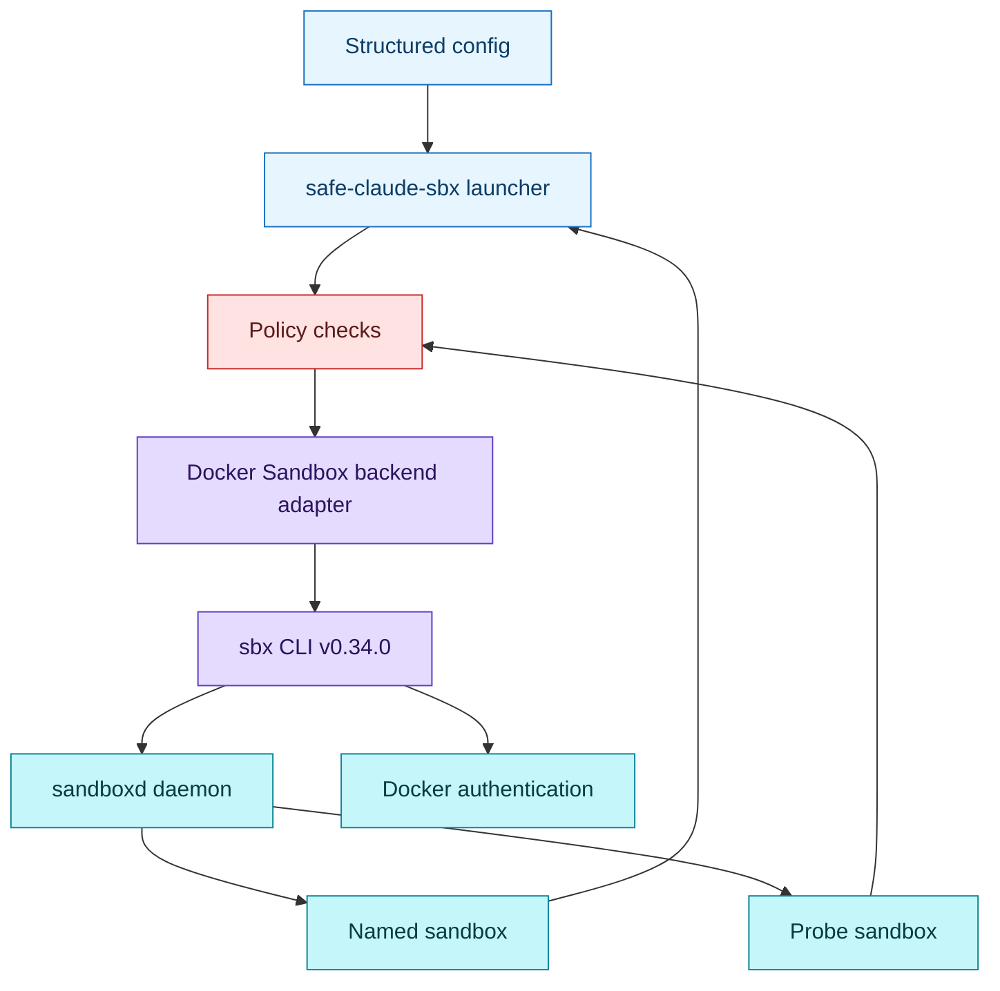
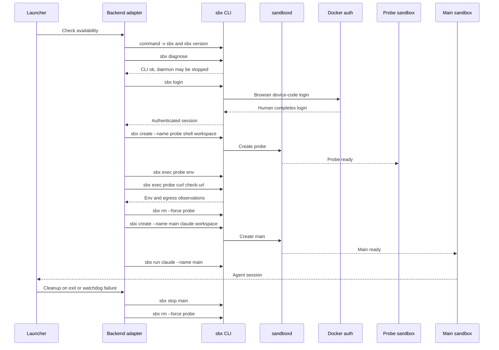
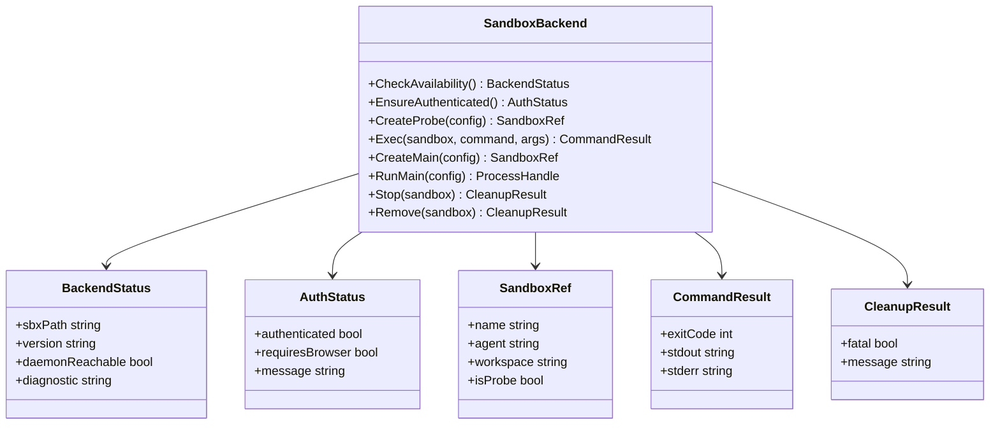

# Docker Sandbox Backend

The first backend is Docker Sandbox / `sbx`.

This page records the command contract observed on the target macOS host for
`sbx v0.34.0` on 2026-07-05. Docker authentication, global network policy setup,
and shell probe creation have been validated on the target machine.

## Availability

The launcher should treat `sbx` as available only when all required preflight
commands can run successfully.

Observed installation flow:

```bash
brew trust docker/tap
brew install docker/tap/sbx
command -v sbx
sbx version
sbx diagnose
```

Observed result:

- `brew trust docker/tap` succeeded.
- `brew install docker/tap/sbx` installed the `sbx` cask successfully.
- `command -v sbx` returned `/opt/homebrew/bin/sbx`.
- `sbx version` returned `sbx version: v0.34.0 2eae0c4fc3894475da3318615f69783b0e7be747`.
- `sbx diagnose` found the CLI and storage directories, but reported the daemon
  as not reachable until `sbx daemon start` is running.
- `sbx ls` starts `sandboxd` when needed and returned exit code `0` after
  authentication, with `No sandboxes found` on an empty machine.

`sbx daemon start` runs as a foreground process and printed:

```text
Starting daemon at /Users/liuqingyuan/Library/Application Support/com.docker.sandboxes/sandboxes/sandboxd/sandboxd.sock (Ctrl+C to stop)...
```

The command did not exit within 45 seconds. A launcher should not assume daemon
startup is a short one-shot command unless a later manual validation proves a
background mode or service manager contract.

## Authentication And Policy

`sbx login` supports browser-based login and non-interactive username/password
input:

```bash
sbx login
sbx login --username <docker-user> --password-stdin
```

Observed `sbx login` behavior without credentials:

```text
Your one-time device confirmation code is: <code>
Open this URL to sign in: https://login.docker.com/activate?user_code=<code>
Waiting for authentication...
```

The command waits for browser/account authentication. After the user completed
the Docker device-code login, `sbx login` exited successfully:

```text
Signed in as ggboy1464.
```

After login, creating a sandbox required initializing the global network policy:

```text
ERROR: global network policy has not been initialized

Initialize it with:
  sbx policy init <allow-all|balanced|deny-all>
```

The target host was initialized with:

```bash
sbx policy init allow-all
```

Observed policy rules after initialization:

- `default-allow-all`: network allow `**`
- `default-fs-read-allow-all`: filesystem read allow `**`
- `default-fs-write-allow-all`: filesystem write allow `**`

Before authentication, these commands fail with exit code `1`:

```text
ERROR: Not authenticated to Docker

Sign in with: sbx login
```

Observed pre-auth commands with this behavior:

- `sbx ls`
- `sbx stop safe-claude-sbx-nonexistent`
- `sbx rm --force safe-claude-sbx-nonexistent`

After authentication, `sbx ls` succeeds with exit code `0` on an empty machine.

## Command Contract

### List Sandboxes

```bash
sbx ls
```

Use this as the authentication and backend reachability check. Before login it
returns exit code `1` with `Not authenticated to Docker`.

After login it returned:

```text
No sandboxes found.
Launch one: sbx run claude
```

with exit code `0`.

### Create Main Sandbox

Prefer `sbx create` when the launcher needs to create the sandbox before
attaching an agent:

```bash
sbx create --name <main-name> claude <workspace>
```

Confirmed help contract:

- `sbx create [flags] AGENT PATH [PATH...]`
- `--name string` sets the sandbox name.
- The default name is `<agent>-<workdir>`.
- Names allow letters, numbers, hyphens, periods, plus signs, and minus signs.
- Additional workspace paths are accepted.
- Append `:ro` to additional workspace paths for read-only mounts.
- `--clone` requests a private in-container clone rather than a bind mount.
- `--profile` assigns a governance profile.
- `--cpus`, `--memory`, `--template`, and `--kit` are available resource/image
  controls.

### Run Or Attach Main Sandbox

Use `sbx run` to attach Claude Code to a created or existing sandbox:

```bash
sbx run claude --name <main-name> <workspace> -- <agent-args>
sbx run --name <main-name>
```

Confirmed help contract:

- `sbx run [flags] [AGENT] [PATH...] [-- AGENT_ARGS...]`
- `--name string` names the sandbox or reattaches to an existing one.
- When reattaching by name, the agent positional argument is optional.
- Agent arguments are passed after `--`.
- Additional workspace paths are accepted, with `:ro` for read-only mounts.
- `--clone`, `--profile`, `--cpus`, `--memory`, `--template`, and `--kit` are
  supported.
- Help text mentions `--detached (-d)`, but the observed flag list did not show
  it. Do not depend on detached `run` until verified after login.

### Probe Sandbox

The MVP should use a separate probe sandbox name derived from configuration,
for example:

```bash
sbx create --name <probe-name> shell <workspace>
sbx exec <probe-name> env
sbx exec <probe-name> curl -fsS <sandbox-check-url>
sbx rm --force <probe-name>
```

The `shell` agent is listed as an available agent for `create` and `run`.

Runtime validation attempted:

```bash
sbx create --name safe-claude-sbx-probe-check shell .
```

The first two attempts passed authentication and policy checks, then failed
during the initial shell image pull with registry/CDN read errors:

```text
failed to pull image: ... Get "https://production.cloudfront.docker.com/...": EOF
failed to pull image: short read: expected 94976614 bytes but got 4905140: unexpected EOF
```

No sandbox was left behind after the failed pull. After switching Clash nodes,
the same command succeeded and created a running probe sandbox:

```text
SANDBOX                       AGENT   STATUS    PORTS   WORKSPACE
safe-claude-sbx-probe-check   shell   running           /Users/liuqingyuan/work/safe-claude-sbx
```

The `shell` probe includes `env`, `sh`, and `curl`.

### Execute Validation Commands

```bash
sbx exec <sandbox-name> env
sbx exec <sandbox-name> curl -fsS <url>
```

Confirmed help contract:

- `sbx exec [flags] SANDBOX COMMAND [ARG...]`
- If the sandbox is stopped, `sbx exec` starts it first.
- Flags match `docker exec` behavior.
- `--env` and `--env-file` can set environment variables for the executed
  command.
- `--workdir`, `--user`, `--interactive`, `--tty`, and `--detach` are available.

Use `sbx exec <probe-name> env` to classify proxy variables. Docker-managed
proxy variables are expected; host or unknown proxy targets are not. Use
`sbx exec <probe-name> curl -fsS <sandbox-check-url>` to verify the sandbox
egress IP.

Observed runtime behavior:

- `sbx exec <probe-name> env` succeeds with exit code `0`.
- Docker's credentials documentation describes the sandbox credential proxy and
  SSH agent forwarding model:
  <https://docs.docker.com/ai/sandboxes/security/credentials/>.
- Docker Sandbox may expose built-in service credential names such as
  `OPENAI_API_KEY` and `ANTHROPIC_API_KEY` as Docker-managed placeholders such
  as `proxy-managed`. The real credential value stays outside the sandbox.
- When the host has an SSH agent, Docker Sandbox may forward it into the sandbox
  as SSH forwarding environment such as `SSH_AUTH_SOCK` and
  `SSH_AUTH_SOCK_GATEWAY`. Private keys stay on the host, but sandbox processes
  can request signatures from the forwarded agent.
- Docker Sandbox injects proxy variables by default inside the sandbox:
  `HTTP_PROXY`, `HTTPS_PROXY`, `http_proxy`, `https_proxy`, `NO_PROXY`, and
  `no_proxy`.
- These values point at Docker Sandbox's internal proxy
  `gateway.docker.internal:3128`; they are not the host Clash proxy port
  `127.0.0.1:7897` configured by the user's shell.
- `sbx exec <probe-name> sh -lc 'command -v curl'` returned `/usr/bin/curl`.
- `curl -fsS https://icanhazip.com` succeeded inside the probe and returned the
  same IP as the host: `123.116.44.34`.
- `curl -fsS https://api.ipify.org` failed both on host and inside the probe on
  the current Clash node with TLS EOF errors, so `api.ipify.org` is not a
  reliable default check URL for this environment.

Docker documentation describes this as the normal networking path: requests
from inside the sandbox go through a sandbox proxy on `gateway.docker.internal`.
The proxy then applies Docker Sandbox policy and forwards allowed traffic
through the host network. The MVP therefore should not require the sandbox to be
proxy-env-free. It should allow Docker-managed proxy values such as
`gateway.docker.internal:3128`, reject host/Clash proxy values such as
`127.0.0.1:7897`, and reject unknown proxy targets. The launcher itself should
not add Clash proxy ports; network consistency should be based on TUN route and
egress validation.

### Timezone, Locale, And Environment

`sbx create` and `sbx run` help output did not expose a general environment flag.
The observed environment controls are on `sbx exec`:

```bash
sbx exec --env TZ=<timezone> --env LANG=<locale> --env LC_ALL=<locale> <sandbox-name> env
```

The backend adapter should not assume main-agent timezone or locale injection is
supported by `sbx run` until runtime validation finds a supported mechanism,
such as a template, kit, profile, secret, or agent argument.

Observed `sbx exec` environment injection:

```bash
sbx exec -e TZ=America/Los_Angeles -e LANG=en_US.UTF-8 -e LC_ALL=en_US.UTF-8 <probe-name> env
```

Inside that exec command, `TZ` and `LANG` reflected the injected values.
`LC_ALL=en_US.UTF-8` was coerced to `LC_ALL=C.UTF-8` by the probe environment.
This confirms per-command exec environment injection, not main-agent launch
environment injection.

### Clean Environment Research

On 2026-07-05, `sbx create --help`, `sbx run --help`, and `sbx exec --help`
were rechecked locally against `/opt/homebrew/bin/sbx`.

Observed clean-env controls:

- `sbx exec` supports `--env` and `--env-file` for one command inside an
  existing sandbox.
- `sbx create` and `sbx run` expose `--profile`, `--template`, and
  experimental `--kit`, but their help output does not document a flag to
  disable default environment inheritance or provide an environment allowlist.
- No create/run help output documented a clean-env profile, template, or kit
  contract that this launcher can safely depend on.

Current launcher behavior:

- The backend adapter runs `sbx` subprocesses with a small host environment
  allowlist: `HOME`, `LOGNAME`, `PATH`, `SHELL`, `TERM`, `TMPDIR`, and `USER`.
- The probe still inspects the sandbox environment after creation. Docker-managed
  credential placeholders such as `proxy-managed` are allowed, raw credential
  values fail closed, host or unknown proxy targets fail closed, and
  SSH forwarding environment such as `SSH_AUTH_SOCK` and
  `SSH_AUTH_SOCK_GATEWAY` is allowed only when
  `environment.allow_ssh_agent_forwarding` is explicitly `true`.
- If a future Docker Sandbox version documents a create/run clean-env,
  allowlist, profile, template, or kit contract, the backend adapter should use
  that official mechanism and keep the inspection step as verification.

Host-side `sbx` and `sandboxd` logs still use the host timezone. A timestamp
such as `time=2026-07-05T21:32:31.321+08:00` should be treated as host/daemon
log time, not proof that the sandbox main agent timezone is configured.

### Stop And Cleanup

Default cleanup policy:

- Stop the main sandbox.
- Remove the probe sandbox.
- Do not remove the main sandbox.
- Treat missing or already-stopped cleanup targets as non-fatal after their
  authenticated exit behavior is confirmed.

Confirmed help contract:

```bash
sbx stop <sandbox-name>
sbx rm --force <sandbox-name>
```

- `sbx stop SANDBOX [SANDBOX...]` stops one or more running sandboxes without
  removing state.
- Stopped sandboxes can be restarted with `sbx run`.
- `sbx rm [SANDBOX...] --force` removes sandboxes and skips confirmation.
- `sbx rm --all --force` removes every sandbox and must not be used by the MVP.

Pre-auth `stop` and `rm` fail at authentication before checking whether the
named sandbox exists.

After authentication, nonexistent cleanup targets returned exit code `1`:

```text
Error: sandbox 'safe-claude-sbx-nonexistent' not found (run 'sbx ls' to see your sandboxes)
```

Observed commands:

- `sbx stop safe-claude-sbx-nonexistent`
- `sbx rm --force safe-claude-sbx-nonexistent`

The launcher should treat this specific authenticated not-found cleanup result
as non-fatal during idempotent cleanup, while still surfacing unexpected cleanup
errors.

Observed real probe cleanup:

- `sbx stop safe-claude-sbx-probe-check` returned exit code `0` and printed
  `Sandbox 'safe-claude-sbx-probe-check' stopped`.
- `sbx exec <stopped-probe> ...` restarted the stopped sandbox automatically,
  matching the help contract.
- `sbx rm --force safe-claude-sbx-probe-check` returned exit code `0` and
  removed the probe.

## Adapter Boundary



## Lifecycle Sequence



## Minimum Backend Interface


